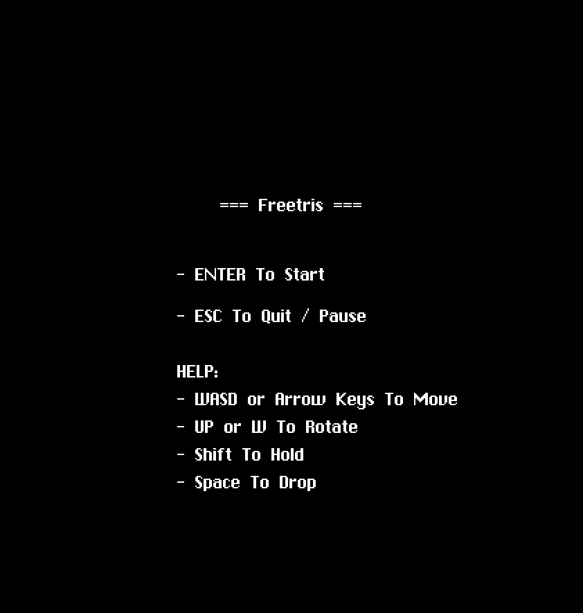
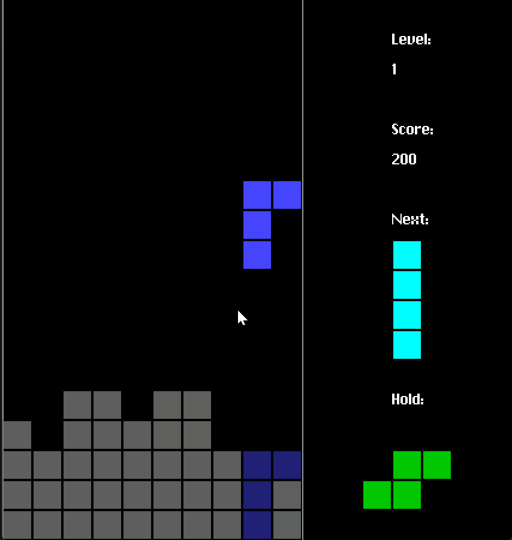

# Freetris

Freetris is a free, Tetris-like game developed in C. It mimics the classic
tile-matching puzzle game.

## Features

- **Complete Set of Tetrominos:** Includes all 7 classic Tetromino shapes.
- **Level Progression:** Players level up by increasing their scores.
- **Dynamic Game Speed:** Speed increases with each level up, challenging the
  player as they progress.
- **Next and Hold Displays:** Shows the next Tetromino and the one held in
  reserve.
- **Score Multiplier:** Rewards more points for clearing multiple rows
  simultaneously.
- **Official Tetromino Colors:** Adheres to the official Tetris guidelines from
  2002 for Tetromino colors.
- **Random Bag System:** Tetrominos are drawn from a 'bag', ensuring all pieces
  appear before any repeats.

## Dependencies

Freetris utilizes the **[kit](https://github.com/rxi/kit)** library, a
single-header graphics library.

Freetris uses **kit** for:

- Window creation
- Rectangle drawing
- Text rendering
- Keyboard input handling

## Build Instructions

### Windows

- To build on Windows, run `build.bat`.
